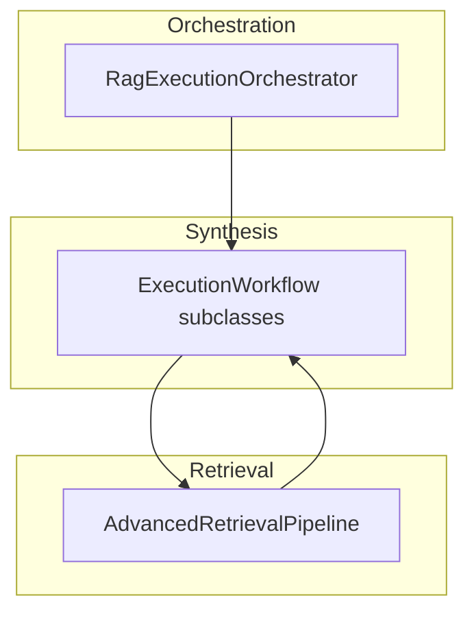

# RAG pipeline contracts

**Purpose:** Explicit **boundaries** between orchestration, retrieval, and answer generation so changes stay localized and testable.

## Layers (normative)

| Boundary | Owner | Consumes | Produces |
| ---------- | ------- | ---------- | ---------- |
| Turn coordination | `RagExecutionOrchestrator` | `ExecutionContext`, `QueryPlan`, routing decisions | `RagExecutionResult`, `ExecutionTrace` |
| Snapshot-bound retrieval | `AdvancedRetrievalPipeline` | `ExecutionContext`, `QueryPlan`, workflow name | `CuratedContextSet`, substage traces |
| LLM answer from workflow | `AbstractExecutionWorkflow` (+ subclasses) | `ExecutionContext`, packed or curated text | Assistant text + workflow stage traces |

## Rules

1. **Dense workflows** (`DocumentDenseRagWorkflow`, `ChunkDenseRagWorkflow`, `ChunkDenseMetadataWorkflow`) call `AdvancedRetrievalPipeline` when advisor-packed context is absent; they **do not** re-implement hybrid fusion or pgvector calls.
2. **`WorkflowSelector`** remains the only chooser for workflow id from resolved config; `QueryPlan` informs planning only (see [`rag-runtime-architecture.md`](../architecture/rag-runtime-architecture.md)).
3. **`QuestionAnswerAdvisor`** is composed at **call time** on the chat path that uses it (see `RagConfiguration` / `RuntimeQueryExecutionService` integration), not on the base `ChatClient` bean, to avoid circular dependencies.

## Related

- [`rag-service/README.md`](../../rag-service/README.md) — execution order and advanced retrieval summary
- [`docs/adr/0005-target-rag-architecture-and-runtime-center.md`](../adr/0005-target-rag-architecture-and-runtime-center.md)
