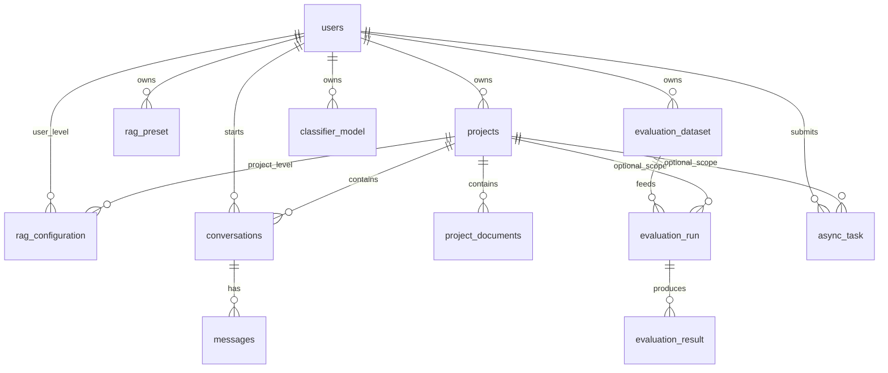
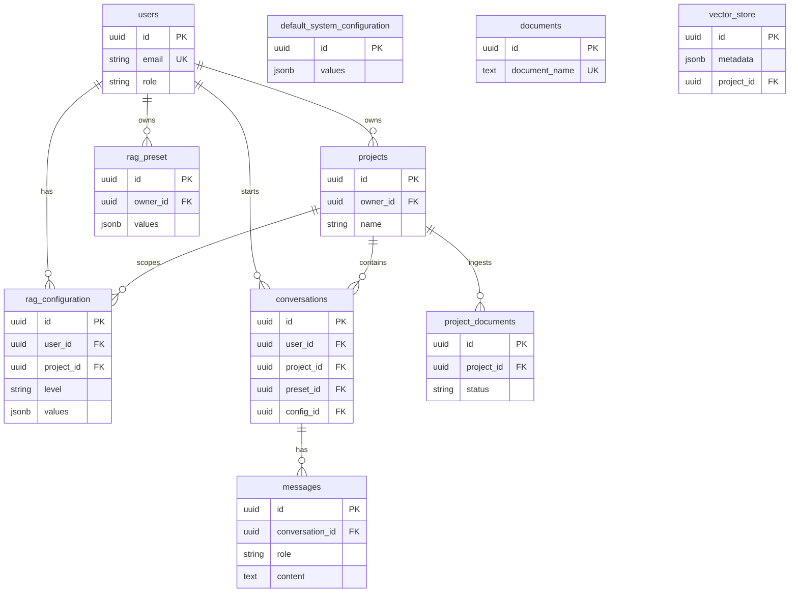
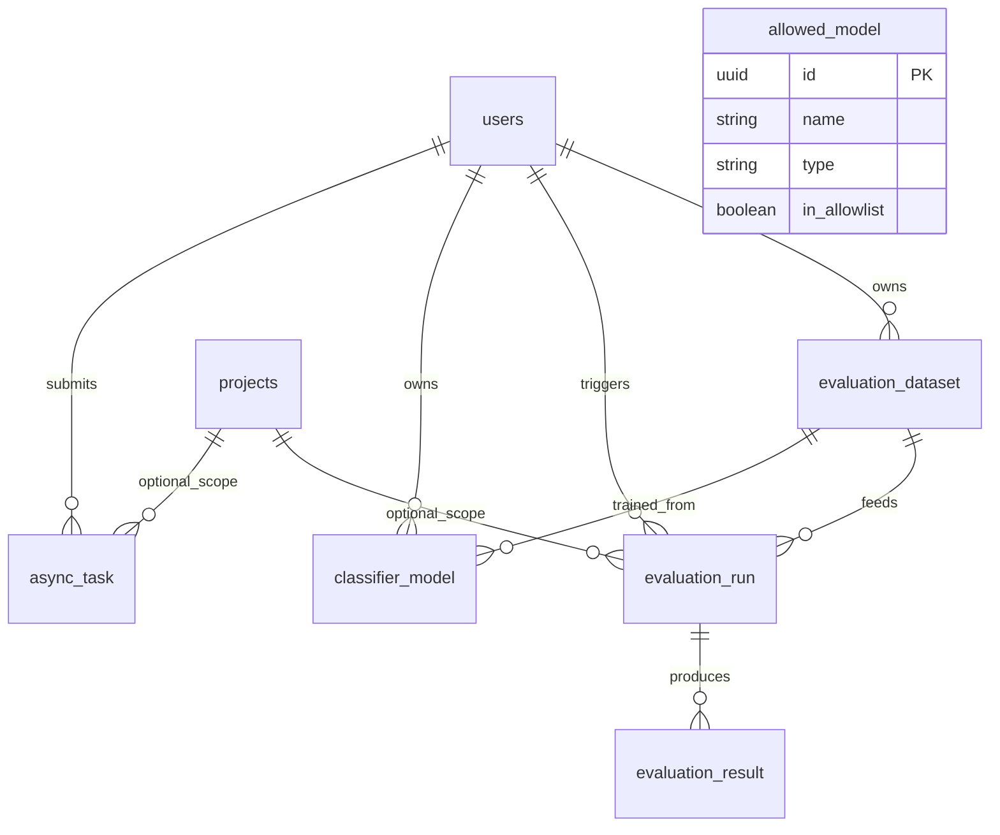

# Data model (summary)

**Source of truth:** Flyway migrations under `rag-service/src/main/resources/db/migration/`.  
This page is the **compact logical + physical reference** for the platform (thesis figures; verify rare tables with SQL if needed).

**Operators:** database image and init layout — [../../db/README.md](../../db/README.md). **Domain concepts:** [../domain/conceptual-model.md](../domain/conceptual-model.md). **Lab vs production promotion:** [ADR 0001](../adr/0001-lab-promotion-modes.md). **Async Lab jobs and evaluation scope:** [ADR 0003](../adr/0003-evaluation-async-project-scope-and-dataset-dedup.md), [integration-flows.md](../architecture/integration-flows.md).

---

## 1. Logical model (overview)

The platform persists: **identity and containers** (user, project, project document), **chat** (conversation, messages, per-conversation document subset), **layered RAG configuration** (mostly JSON values), **presets**, **LLM allowlist**, **evaluation** (datasets, runs, per-question results), **classifier model metadata** (artifact path + DB row), and **async Lab jobs**.

---

## 2. Entity-relationship (Mermaid — core + config)

---

## 3. Evaluation, classifier, governance, jobs

**Tables:** `evaluation_dataset`, `evaluation_run`, `evaluation_result` (V9); `classifier_model` (V10); `allowed_model` (V8); `async_task` (V17). Nullable `project_id` on `evaluation_run` and `async_task`: [V19](../../rag-service/src/main/resources/db/migration/V19__project_scope_evaluation_and_async_task.sql); see [ADR 0003](../adr/0003-evaluation-async-project-scope-and-dataset-dedup.md).

**`classifier_model` (V10)** matches the classifier microservice contract: `owner_id`, optional `dataset_id` / `dataset_sha`, `hyperparams` JSONB, scalar metrics (`accuracy`, `f1_macro`), `artifact_path` (on-disk or shared storage), `is_active`, `passes_gate`, `trained_at`, `status` (`TRAINING` \| `READY` \| `ERROR`). Training/evaluation **jobs** are tracked in `async_task`; this table is the **catalog row** for a trained artifact. For RAG runtime, **`artifact_path` stores the classifier-service inference tag** (same string as `modelId` in train/eval JSON responses). **Explicit activation** (Lab/API) merges `classifierModelId` into the **project** `rag_configuration` JSON with that tag (ADR 0001 — never silent). Details: [classifier-service README](../../classifier-service/README.md), Lab flows in [integration-flows.md](../architecture/integration-flows.md).

**Classifier ML runtime (HTTP, on-disk weights):** see [classifier-service README](../../classifier-service/README.md).

---

## 4. Keys and identifiers

| Convention | Detail |
|------------|--------|
| **Primary keys** | UUID on business entities (migrations). |
| **Foreign keys** | `owner_id` / `user_id` → `users.id`; `project_id` → `projects.id`; `conversation_id` → `conversations.id`; `dataset_id` → `evaluation_dataset.id`; `run_id` → `evaluation_run.id`. |
| **Uniqueness** | User email UK; `allowed_model (name, type)` unique; partial unique indexes on `rag_configuration` for at most one active `USER_DEFAULT` per user and one active `PROJECT` per `(user_id, project_id)` (V5). |
| **Deletes** | Mostly `ON DELETE CASCADE` from user/project; evaluation cascades from dataset/run where defined (V9). |

---

## 5. Columns vs JSONB

**Rule:** stable, filterable, constrained fields in **columns**; evolving RAG feature sets in **JSONB** with application validation (sanitizers / schema).

| Area | Columns | JSONB |
|------|---------|-------|
| `rag_configuration`, `default_system_configuration` | `level`, `is_active`, timestamps, `name` | `values` (topK, models, flags, …) |
| `rag_preset` | name, tags, system flag, ownership | `values` |
| `conversations` | title, optional model columns | `document_filter` (document IDs); `runtime_override_jsonb` (config only); **`pending_clarification_jsonb`** (P11: versioned clarification loop payload, nullable) |
| `evaluation_run` | `type`, `status`, `progress` | `config_ids` |
| `evaluation_result` | optional scalar metrics | `config_snapshot`, `sources` |
| `classifier_model` | metrics, `is_active`, `passes_gate`, `artifact_path`, status | `hyperparams` |
| `async_task` | `task_type`, `status`, progress text | `request_payload`, `result_json` |
| `resolved_config_snapshot` | `created_at`, `effective_system_prompt`, `config_hash` | `payload_jsonb`, `capability_set_jsonb`, `compatibility_result_jsonb`, `reindex_impact_jsonb`, `system_prompt_layers_jsonb`, `provenance_jsonb` (see [Section 6.1](DATA_MODEL.md#dm-s6-1)) |
| `runtime_execution_trace` | linkage (`user_id`, `project_id`, optional `conversation_id`/`message_id`), `correlation_id`, optional `resolved_config_snapshot_id`/`config_hash`, extracted summary columns (memory/routing/tool/FC/advisor/judge/clarification), `schema_version`, `created_at` | `execution_trace_jsonb` (bounded `ExecutionTrace` projection), `stages_jsonb` (bounded `ExecutionStageTrace` list) |
| `runtime_trace_regression_suite_definition`, `runtime_trace_regression_suite_definition_entry`, `runtime_trace_regression_suite_definition_entry_trace` | **P33:** per-user named suite definitions (`UNIQUE (user_id, name)`), ordered entries (`entry_kind` **BY_TRACE_IDS** / **BY_CONVERSATION**), child rows for trace ids **only** for **BY_TRACE_IDS** | — (no JSONB / array column for trace ids) |
| `runtime_trace_regression_suite_run`, `runtime_trace_regression_suite_run_entry` | **P41:** per-user suite **run** header + summary counters + one row per executed entry (bounded scalars only); **`definition_id`** opaque UUID when `source_type = SAVED_DEFINITION` (**no FK** to definitions) | — (no JSONB / arrays / trace blobs) |
| `knowledge_index_snapshot`, `knowledge_snapshot_document`, `document_artifact`, `reindex_event`; extended `project_documents` | scope, snapshot FK, storage columns, `requires_reindex` | Artifact payloads (`schemaVersion`); METADATA holds structured-search projection when applicable ([Section 6.2](DATA_MODEL.md#dm-s6-2)) |

**Trade-off:** JSON stays flexible for TFG iteration; heavy reporting may need GIN indexes or extracted columns later.

---

## 6. Active configuration resolution

There is **no** single global “active_config” row. **Effective** RAG parameters are **computed at read time** (merge order; see `ConfigResolver` + `RagConfigurationMerge` in `rag-service`):

1. Deployment defaults + latest `default_system_configuration` (by `updated_at`).
2. **User layer:** `rag_configuration` (`level = USER_DEFAULT`, `project_id` IS NULL, active), merged in the adapter with `user_preferences.preferences_jsonb` and `user_personalization.personalization_jsonb` (later maps win on key conflicts).
3. **Project layer:** `rag_configuration` (`level = PROJECT` for `(user_id, project_id)`, active) and `projects.project_prompt` (feeds prompt composition separately from JSON merge).
4. **Preset + profiles (when `preset_id` is supplied):** `rag_preset.values` plus ordered `config_profile.payload` rows linked by `rag_preset_profile_ref` (`ordinal`). Raw rows are loaded via `ConfigurationSourcePort.loadPresetProfileCompositionSources`; **merge** is only in `ConfigResolver` (`PresetProfilePayloadMerge` then `RagConfigurationMerge`).
5. **Conversation runtime JSON:** `conversations.runtime_override_jsonb` when a `conversation_id` is supplied (load-only port); merged **before** the terminal request override.
6. **Terminal request JSON:** HTTP request body override map; wins over the conversation runtime map on key conflicts when both are present.

Chat execution paths that pass a **single** merged JSON node (e.g. legacy chat overlay) still delegate to the same resolver entrypoints; they do not reimplement merge.

**ADR:** [0002-multitenancy-assumption.md](../adr/0002-multitenancy-assumption.md).

### 6.1 `resolved_config_snapshot` (configuration artefact, not a run)

**Migrations:** baseline [V21](../../rag-service/src/main/resources/db/migration/V21__config_profiles_and_presets.sql); semantic columns [V25](../../rag-service/src/main/resources/db/migration/V25__resolved_config_snapshot_semantic_columns.sql).

This table stores a **reproducible, insert-only** snapshot of **resolved** runtime configuration. It is **not** `evaluation_run`, **not** `knowledge_index_snapshot`, **not** an execution trace. `evaluation_run.resolved_config_snapshot_id` references this table when a lab run pins configuration.

### 6.3 `runtime_execution_trace` (orchestrated runtime trace artefact)

**Migration:** [V31](../../rag-service/src/main/resources/db/migration/V31__runtime_execution_trace.sql).

This table stores a **reproducible, append-only** persisted trace artefact for one completed orchestrated runtime turn. It is a **bounded projection** of the finalized in-memory `ExecutionTrace` (plus linkage ids), written as a best-effort append step after the turn completes. It is not `messages.execution_metadata` and must not be re-derived by re-running runtime logic.

| Column | Required on product insert | Purpose |
|--------|----------------------------|---------|
| `id`, `created_at` | yes (DB-generated) | Primary key and timestamp. |
| `payload_jsonb` | yes | Versioned **projection** of transitional `RagConfig` (`toValueMap()` at write time); audit/replay, not the canonical domain model. May include fixed key **`knowledgeBuildProjection`** (nested JSON from `KnowledgeBuildProjectionMapper`, `projectionVersion` ≥ 1) when the row is created for knowledge execute-without-pin. |
| `capability_set_jsonb` | yes | `CapabilitySet` JSON (mapper-owned shape). |
| `compatibility_result_jsonb` | yes | Compatibility rule engine output. |
| `reindex_impact_jsonb` | yes | `ReindexImpact` (V25). |
| `system_prompt_layers_jsonb` | yes | Four-layer prompt inputs before composition (V25). |
| `effective_system_prompt` | yes, non-blank | Output of `SystemPromptComposer` (V25). |
| `provenance_jsonb` | yes | Domain provenance plus **`schema_version`** (int), **`creatingUserId`** (UUID string), optional **`correlationId`**, optional **`projectId`** (UUID string) for knowledge pin validation. |
| `config_hash` | yes | `ResolvedRuntimeConfigHasher` SHA-256 over canonical `ResolvedRuntimeConfig` JSON; when `payload_jsonb` carries **`knowledgeBuildProjection`**, the same hasher appends that nested map so the digest covers the knowledge slice. |
| `conversation_id`, `message_id`, `job_id` | optional | Optional linkage when the client supplies them. |
| `prompt_stack_preview_jsonb` | omit (null) | Legacy; not written for new rows. |

**Forward compatibility:** new snapshot JSON keys and new nullable columns should be **additive** only; readers ignore unknown keys where possible.

### 6.4 `runtime_trace_regression_suite_*` (saved regression suite definitions — P33)

**Migration:** [V32](../../rag-service/src/main/resources/db/migration/V32__runtime_trace_regression_suite_definition.sql).

These tables persist **reusable suite definitions** (metadata + ordered entries). They do **not** store suite **execution** results, export blobs, or run history. **`RuntimeTraceRegressionSuiteDefinitionService`** (`application.service.runtime.traceregressionsuitedefinition`) is the **only** application owner for writes/reads; it can **materialize** a **`RuntimeTraceRegressionSuiteRequest`** (P30 shape) for the owning user — **read/map only**, without calling **`RuntimeTraceRegressionSuiteService#execute`**. P33 does **not** add HTTP routes for definitions (future phases may add REST on top of this service).

| Table | Role |
|-------|------|
| `runtime_trace_regression_suite_definition` | `id`, `user_id`, `name` (**UNIQUE** per user), optional `description`, `schema_version`, `created_at`, `updated_at`. |
| `runtime_trace_regression_suite_definition_entry` | One row per ordered entry (`position` 0…n−1), `entry_kind`, nullable conversation/timestamp/workflow columns per kind; **CHECK** constraints align with P30 entry shapes. |
| `runtime_trace_regression_suite_definition_entry_trace` | For **BY_TRACE_IDS** entries only: ordered `trace_id` rows (`position`); **no** rows for **BY_CONVERSATION** entries. |

### 6.5 `runtime_trace_regression_suite_run*` (regression suite run snapshots — P41)

**Migration:** [V33](../../rag-service/src/main/resources/db/migration/V33__runtime_trace_regression_suite_run.sql).

These tables persist a **minimal, query-ready snapshot** of a completed **`RuntimeTraceRegressionSuiteResult`** (P30): **no** re-execution, **no** batch payloads, **no** JSONB. **`RuntimeTraceRegressionSuiteRunPersistenceService`** (`application.service.runtime.traceregressionsuiterun`) is the **only** Spring owner for writes/reads to these tables. **`definition_id`** is stored as an opaque UUID when `source_type = SAVED_DEFINITION` (no FK to **`runtime_trace_regression_suite_definition`**). Child **`runtime_trace_regression_suite_run_entry`** rows use **`ON DELETE CASCADE`** from the parent run.

| Table | Role |
|-------|------|
| `runtime_trace_regression_suite_run` | Run header: `user_id`, `source_type` (**AD_HOC** \| **SAVED_DEFINITION**), optional `definition_id` (required iff **SAVED_DEFINITION**), `suite_outcome`, five suite summary integers mirroring **`RuntimeTraceRegressionSuiteSummary`**, `created_at`; table-level **CHECK**s tie counters together. |
| `runtime_trace_regression_suite_run_entry` | One row per entry (`entry_order` 0…19): `entry_kind`, capped `selector_echo`, `execution_status` (**BATCH_RETURNED** \| **EXECUTION_FAILED**), either batch outcome + three counts **or** failure kind (+ optional `failure_detail`) per row-shape **CHECK**. |

### 6.2 Knowledge system (snapshots, artifacts, reindex)

**Migrations:** [V22](../../rag-service/src/main/resources/db/migration/V22__knowledge_snapshots_and_documents.sql); optional FK [V26](../../rag-service/src/main/resources/db/migration/V26__knowledge_index_snapshot_resolved_config_fk.sql) on `knowledge_index_snapshot.resolved_config_snapshot_id` → `resolved_config_snapshot(id)`; **`reindex_event.resolved_config_snapshot_id` NOT NULL** [V27](../../rag-service/src/main/resources/db/migration/V27__reindex_event_resolved_config_snapshot.sql); **`knowledge_index_snapshot` config linkage NOT NULL** [V28](../../rag-service/src/main/resources/db/migration/V28__knowledge_index_snapshot_config_linkage_not_null.sql).

**Scope (corpus):** `project_documents.corpus_scope` is `PROJECT_SHARED` (conversation null) or `CHAT_LOCAL` (conversation set). `knowledge_index_snapshot.scope_type` is `PROJECT` or `CONVERSATION` with matching `project_id` / `conversation_id` (see [knowledge-system-model.md](knowledge-system-model.md)).

**`knowledge_index_snapshot`**

| Column | Required on insert | Notes |
|--------|-------------------|--------|
| `id` | yes (generated) | PK |
| `signature_hash` | yes | Immutable after insert; deterministic over index inputs + document ids/checksums |
| `scope_type` | yes | `PROJECT` \| `CONVERSATION` |
| `project_id` | yes for product builds | FK `projects` |
| `conversation_id` | optional | Required when `scope_type = CONVERSATION` |
| `status` | yes | `BUILDING` \| `ACTIVE` \| `SUPERSEDED` \| `FAILED` |
| `resolved_config_snapshot_id` | yes (V28) | FK → `resolved_config_snapshot(id)`; required on every row |
| `resolved_config_hash` | yes (V28) | Hex digest matching `resolved_config_snapshot.config_hash` for that id |
| `created_at`, `updated_at` | yes | Immutable vs lifecycle-only per service rules |

**`document_artifact`**

| Column | Required on insert | Notes |
|--------|-------------------|--------|
| `id` | yes (generated) | PK |
| `document_id` | yes | FK `project_documents` |
| `artifact_type` | yes | `PARSED` \| `METADATA` \| `CHUNK` \| `INDEX` |
| `payload_jsonb` | yes | Must include top-level **`schemaVersion`** (int); deterministic key order in serializers used for hashing |
| `content_hash` | required in application logic | SHA-256 hex over canonical JSON for new rows |
| `created_at` | yes | Insert-only rows (no semantic UPDATE) |

**`reindex_event`**

| Column | Required on insert | Notes |
|--------|-------------------|--------|
| `id` | yes (generated) | PK |
| `document_id`, `project_id`, `conversation_id` | optional | Nullable per V22 |
| `reason` | yes | Short code (e.g. config soft/hard, operator) |
| `target_signature_hash` | yes | Target snapshot signature for the run |
| `status` | yes | `PENDING` \| `RUNNING` \| … |
| `async_task_id` | optional | |
| `resolved_config_snapshot_id` | yes (V27) | FK → `resolved_config_snapshot(id)` ON DELETE RESTRICT |
| `created_at`, `updated_at` | yes | |

**STRUCTURED_SEARCH:** structured projection for search is stored **only** in the **METADATA** artifact `payload_jsonb` (e.g. under `structuredSearchProjection`); no extra columns for structured search in 3.1.

**JSONB:** All `document_artifact.payload_jsonb` values must contain `"schemaVersion"`; serializers used for `content_hash` use a fixed key order.

---

## 7. Storage patterns (datasets, results, ML artifacts)

| Resource | Database | Binary / large payload |
|----------|----------|-------------------------|
| **Evaluation datasets** | `evaluation_dataset` metadata (`file_name`, `sha256`, `question_count`, …) | File typically **outside** DB (volume, object store); path by convention |
| **Evaluation results** | `evaluation_result` per question; JSON for snapshots/sources | N/A |
| **Classifier models** | `classifier_model` row (metrics, `artifact_path`, flags) | Weights/files on **shared filesystem** or object storage |
| **Lab jobs** | `async_task` status + `result_json` summary | Heavy artifacts **not** duplicated here |

Horizontal scaling of workers: external queue or DB lease (outside this relational model).

---

## 8. Naming and versioning

- **Tables:** snake_case (`users`, `projects`, `rag_configuration`, `evaluation_dataset`, …).
- **Config level:** application enum aligned with SQL `CHECK` on `rag_configuration.level` (V5).
- **Datasets:** `sha256` + `uploaded_at`; new content → new row or same `dataset_id` by policy.
- **Presets:** version by `updated_at` or new row (product choice).
- **ClassifierModel:** UUID PK; logical version can be `(owner_id, name, trained_at)` or a future `version` column.

---

## 9. Physical tables (baseline, Flyway V1–V26)

| Table | Migration | Notes |
|-------|-----------|--------|
| `users` | V2 | |
| `projects` | V3 | |
| `project_documents` | V4 | |
| `documents`, `vector_store` | V1 + V4 | Legacy corpus + `project_id` scope |
| `default_system_configuration`, `rag_configuration` | V5 | |
| `rag_preset` | V6 | |
| `conversations`, `messages` | V7 | |
| `allowed_model` | V8 | |
| `evaluation_dataset`, `evaluation_run`, `evaluation_result` | V9 | |
| `classifier_model` | V10 | |
| `message_feedback` | V11 | |
| `audit_log` | V12 | |
| `scheduled_evaluation` | V13 | |
| `prompt_template` | V14 | |
| `response_cache` | V15 | |
| seed / demo | V16, V18 | |
| `async_task` | V17 | |
| `evaluation_run.project_id`, `async_task.project_id` | V19 | Nullable FK to `projects`, `ON DELETE SET NULL`; see ADR 0003 |
| `config_profile`, `rag_preset_profile_ref`, `resolved_config_snapshot`, `user_preferences`, `user_personalization`; `rag_preset.composition_version`; `projects.project_prompt`; `conversations.runtime_override_jsonb` | V21 | Config profiles, preset–profile composition, resolved snapshot baseline, prefs/personalization |
| `resolved_config_snapshot` (semantic columns) | V25 | `reindex_impact_jsonb`, `system_prompt_layers_jsonb`, `effective_system_prompt` |
| Knowledge snapshots, artifacts, reindex; `project_documents` corpus columns | V22 | See [Section 6.2](DATA_MODEL.md#dm-s6-2) |
| `knowledge_index_snapshot.resolved_config_snapshot_id` FK | V26 | Additive FK when missing |
| `reindex_event.resolved_config_snapshot_id` NOT NULL + index | V27 | Mandatory config provenance for reindex rows |
| `knowledge_index_snapshot` resolved linkage NOT NULL | V28 | Drops orphan snapshots without config id/hash |
| `vector_store` FTS / indexing helpers | V29 | |
| `conversations.pending_clarification_jsonb` | V30 | P11 deterministic clarification pending state (JSONB, nullable) |

**JPA:** `EvaluationRunEntity`, `AsyncTaskEntity` optional `@ManyToOne` to `ProjectEntity` (`project_id`). **`ResolvedConfigSnapshotEntity`** maps `resolved_config_snapshot` ([Section 6.1](DATA_MODEL.md#dm-s6-1)). Knowledge tables: `KnowledgeIndexSnapshotEntity`, `KnowledgeSnapshotDocumentEntity`, `DocumentArtifactEntity`, `ReindexEventEntity`; workspace documents remain `KnowledgeDocumentEntity` → `project_documents`. **`ConversationEntity.pendingClarification`** maps `pending_clarification_jsonb`.

---

## 10. `evaluation_run` vs `async_task` (two “run” worlds)

| Aspect | `evaluation_run` (+ `evaluation_result`) | `async_task` |
|--------|------------------------------------------|--------------|
| **Purpose** | Durable **batch evaluation** over an uploaded **dataset**: one run row drives many per-question `evaluation_result` rows (historical reporting, comparisons). | **HTTP 202 async jobs** for Lab (and similar): LLM/RAG eval shortcuts, classifier train/eval, Ollama pull; status and summary JSON in-table. |
| **Lifecycle** | Tied to `evaluation_dataset`; progress fields; typically long-running batch in product sense. | `QUEUED` → … → terminal; polled via `/lab/jobs/{id}` or SSE (`/events`). |
| **API mapping** | Product/evaluation flows that upload datasets and record structured evals (“runs” in the batch sense — see [ADR 0003](../adr/0003-evaluation-async-project-scope-and-dataset-dedup.md)). | Lab endpoints under `…/lab/…` returning **202** + job id; optional `projectId` query param persists `project_id` when the user owns the project ([ADR 0003](../adr/0003-evaluation-async-project-scope-and-dataset-dedup.md)). |
| **Project scope** | Optional `project_id` (V19) when the product attaches a project to a batch run. | Optional `project_id` (V19) for traceability; omitted ⇒ global/user-scoped job. |

Do **not** conflate the two: a Lab “eval LLM” `async_task` is **not** an `evaluation_run` row unless a future product flow explicitly creates both.

---

## 11. Optional future extensions (design only)

- `user_classifier_policy` (user_id, preferred_classifier_model_id) if classifier selection outgrows JSON in `RagConfig`.
- GIN indexes on JSONB paths only if query patterns require them.

---

## 12. Risks and trade-offs

| Risk | Mitigation |
|------|------------|
| JSON without strict DB schema | Write-time sanitization; characterization tests for merge; document keys (e.g. configuration schema in application). |
| Duplicate datasets (same SHA) | Application-level dedup by **`(owner_id, sha256)`** when hashing is available; no mandatory UK in DB for thesis scope ([ADR 0003](../adr/0003-evaluation-async-project-scope-and-dataset-dedup.md)). |
| `artifact_path` not portable | Environment-specific prefixes; avoid hard-coded absolute paths. |
| Two “run” concepts (`evaluation_run` vs `async_task`) | See [Section 10](DATA_MODEL.md#dm-s10); use the right table per flow. |
| `evaluation_result` growth | Retention/partitioning later; index on `run_id` (V9). |

---

## 13. Open questions (remaining product/schema)

1. Single active `classifier_model` per user, per project, or global (ADMIN)?
2. Conversation-level config: new `rag_configuration` level vs JSON-only on `conversations` (product design choice; not fixed in this schema — see [conceptual-model.md](../domain/conceptual-model.md)).

**Resolved (see [ADR 0003](../adr/0003-evaluation-async-project-scope-and-dataset-dedup.md)):** nullable FK `project_id` on `evaluation_run` and `async_task`; dataset dedup policy `(owner_id, sha256)` at application level.

---

## Legacy corpus vs project scope

- `documents` / `vector_store` originate from the **V1** corpus model; later migrations add **`project_id`** on `vector_store` and **`project_documents`** for per-project ingestion status.
- Chat retrieval should respect **active project** and filters from the product API; see [RAG.md](../RAG.md).
