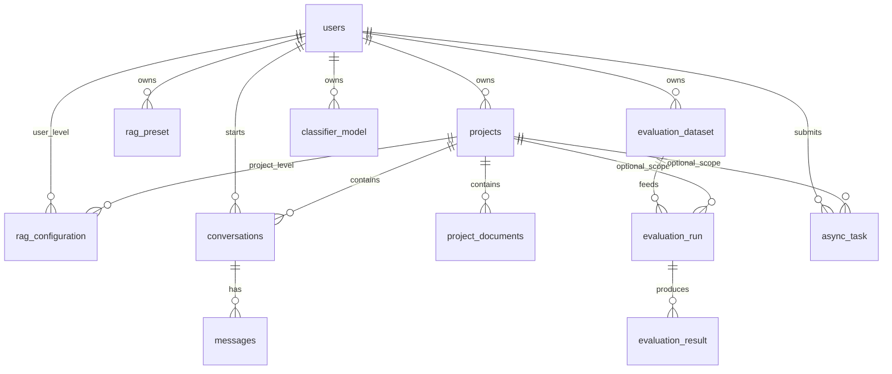
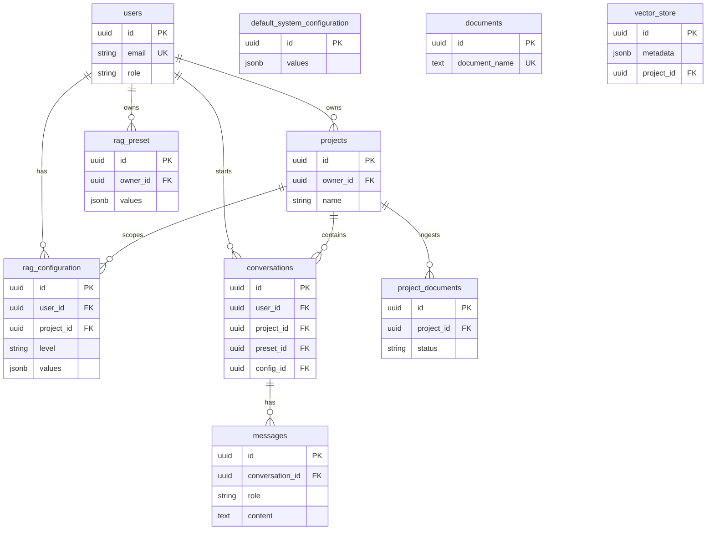
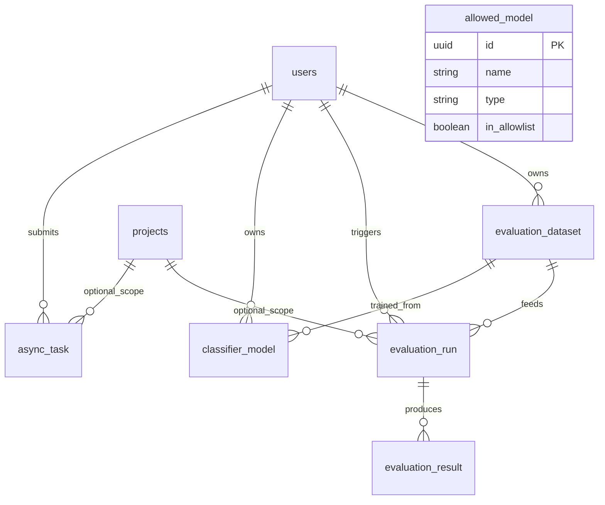

# Data model (summary)

**Source of truth:** Flyway migrations under `rag-service/src/main/resources/db/migration/`.  
This page is the **compact logical + physical reference** for the platform (thesis figures; verify rare tables with SQL if needed).

**Operators:** database image and init layout — [../../db/README.md](../../db/README.md). **Domain concepts:** [../domain/conceptual-model.md](../domain/conceptual-model.md). **Lab vs production promotion:** [ADR 0001](../adr/0001-lab-promotion-modes.md). **Async Lab jobs and evaluation scope:** [ADR 0003](../adr/0003-evaluation-async-project-scope-and-dataset-dedup.md), [integration-flows.md](../architecture/integration-flows.md).

---

## 1. Logical model (overview)

The platform persists: **identity and containers** (user, project, project document), **chat** (conversation, messages, per-conversation document subset), **layered RAG configuration** (mostly JSON values), **presets**, **LLM allowlist**, **evaluation** (datasets, runs, per-question results), **classifier model metadata** (artifact path + DB row), and **async Lab jobs**.

---

## 2. Entity-relationship (Mermaid — core + config)

---

## 3. Evaluation, classifier, governance, jobs

**Tables:** `evaluation_dataset`, `evaluation_run`, `evaluation_result` (V9); `classifier_model` (V10); `allowed_model` (V8); `async_task` (V17). Nullable `project_id` on `evaluation_run` and `async_task`: [V19](../../rag-service/src/main/resources/db/migration/V19__project_scope_evaluation_and_async_task.sql); see [ADR 0003](../adr/0003-evaluation-async-project-scope-and-dataset-dedup.md).

**`classifier_model` (V10)** matches the classifier microservice contract: `owner_id`, optional `dataset_id` / `dataset_sha`, `hyperparams` JSONB, scalar metrics (`accuracy`, `f1_macro`), `artifact_path` (on-disk or shared storage), `is_active`, `passes_gate`, `trained_at`, `status` (`TRAINING` \| `READY` \| `ERROR`). Training/evaluation **jobs** are tracked in `async_task`; this table is the **catalog row** for a trained artifact. For RAG runtime, **`artifact_path` stores the classifier-service inference tag** (same string as `modelId` in train/eval JSON responses). **Explicit activation** (Lab/API) merges `classifierModelId` into the **project** `rag_configuration` JSON with that tag (ADR 0001 — never silent). Details: [classifier-service README](../../classifier-service/README.md), Lab flows in [integration-flows.md](../architecture/integration-flows.md).

**Classifier ML runtime (HTTP, on-disk weights):** see [classifier-service README](../../classifier-service/README.md).

---

## 4. Keys and identifiers

| Convention | Detail |
|------------|--------|
| **Primary keys** | UUID on business entities (migrations). |
| **Foreign keys** | `owner_id` / `user_id` → `users.id`; `project_id` → `projects.id`; `conversation_id` → `conversations.id`; `dataset_id` → `evaluation_dataset.id`; `run_id` → `evaluation_run.id`. |
| **Uniqueness** | User email UK; `allowed_model (name, type)` unique; partial unique indexes on `rag_configuration` for at most one active `USER_DEFAULT` per user and one active `PROJECT` per `(user_id, project_id)` (V5). |
| **Deletes** | Mostly `ON DELETE CASCADE` from user/project; evaluation cascades from dataset/run where defined (V9). |

---

## 5. Columns vs JSONB

**Rule:** stable, filterable, constrained fields in **columns**; evolving RAG feature sets in **JSONB** with application validation (sanitizers / schema).

| Area | Columns | JSONB |
|------|---------|-------|
| `rag_configuration`, `default_system_configuration` | `level`, `is_active`, timestamps, `name` | `values` (topK, models, flags, …) |
| `rag_preset` | name, tags, system flag, ownership | `values` |
| `conversations` | title, optional model columns | `document_filter` (document IDs); runtime overrides if persisted |
| `evaluation_run` | `type`, `status`, `progress` | `config_ids` |
| `evaluation_result` | optional scalar metrics | `config_snapshot`, `sources` |
| `classifier_model` | metrics, `is_active`, `passes_gate`, `artifact_path`, status | `hyperparams` |
| `async_task` | `task_type`, `status`, progress text | `request_payload`, `result_json` |

**Trade-off:** JSON stays flexible for TFG iteration; heavy reporting may need GIN indexes or extracted columns later.

---

## 6. Active configuration resolution

There is **no** single global “active_config” row. **Effective** RAG parameters are **computed at read time** (merge order):

1. Deployment defaults + latest `default_system_configuration` (by `updated_at`).
2. `rag_configuration` with `level = USER_DEFAULT` and `project_id` IS NULL, active.
3. `rag_configuration` with `level = PROJECT` for `(user_id, project_id)`, active.
4. Optional request/chat JSON overrides (often not persisted).
5. **Preset:** `conversations.preset_id` → apply preset snapshot semantics in application (see preset service), not only SQL.

Implementation reference: `ConfigResolver` / `RagConfigurationMerge` in `rag-service` (`com.uniovi.rag.service.config`, `com.uniovi.rag.domain.config`).

**ADR:** [0002-multitenancy-assumption.md](../adr/0002-multitenancy-assumption.md).

---

## 7. Storage patterns (datasets, results, ML artifacts)

| Resource | Database | Binary / large payload |
|----------|----------|-------------------------|
| **Evaluation datasets** | `evaluation_dataset` metadata (`file_name`, `sha256`, `question_count`, …) | File typically **outside** DB (volume, object store); path by convention |
| **Evaluation results** | `evaluation_result` per question; JSON for snapshots/sources | N/A |
| **Classifier models** | `classifier_model` row (metrics, `artifact_path`, flags) | Weights/files on **shared filesystem** or object storage |
| **Lab jobs** | `async_task` status + `result_json` summary | Heavy artifacts **not** duplicated here |

Horizontal scaling of workers: external queue or DB lease (outside this relational model).

---

## 8. Naming and versioning

- **Tables:** snake_case (`users`, `projects`, `rag_configuration`, `evaluation_dataset`, …).
- **Config level:** application enum aligned with SQL `CHECK` on `rag_configuration.level` (V5).
- **Datasets:** `sha256` + `uploaded_at`; new content → new row or same `dataset_id` by policy.
- **Presets:** version by `updated_at` or new row (product choice).
- **ClassifierModel:** UUID PK; logical version can be `(owner_id, name, trained_at)` or a future `version` column.

---

## 9. Physical tables (baseline, Flyway V1–V19)

| Table | Migration | Notes |
|-------|-----------|--------|
| `users` | V2 | |
| `projects` | V3 | |
| `project_documents` | V4 | |
| `documents`, `vector_store` | V1 + V4 | Legacy corpus + `project_id` scope |
| `default_system_configuration`, `rag_configuration` | V5 | |
| `rag_preset` | V6 | |
| `conversations`, `messages` | V7 | |
| `allowed_model` | V8 | |
| `evaluation_dataset`, `evaluation_run`, `evaluation_result` | V9 | |
| `classifier_model` | V10 | |
| `message_feedback` | V11 | |
| `audit_log` | V12 | |
| `scheduled_evaluation` | V13 | |
| `prompt_template` | V14 | |
| `response_cache` | V15 | |
| seed / demo | V16, V18 | |
| `async_task` | V17 | |
| `evaluation_run.project_id`, `async_task.project_id` | V19 | Nullable FK to `projects`, `ON DELETE SET NULL`; see ADR 0003 |

**JPA:** `EvaluationRunEntity`, `AsyncTaskEntity` optional `@ManyToOne` to `ProjectEntity` (`project_id`).

---

## 10. `evaluation_run` vs `async_task` (two “run” worlds)

| Aspect | `evaluation_run` (+ `evaluation_result`) | `async_task` |
|--------|------------------------------------------|--------------|
| **Purpose** | Durable **batch evaluation** over an uploaded **dataset**: one run row drives many per-question `evaluation_result` rows (historical reporting, comparisons). | **HTTP 202 async jobs** for Lab (and similar): LLM/RAG eval shortcuts, classifier train/eval, Ollama pull; status and summary JSON in-table. |
| **Lifecycle** | Tied to `evaluation_dataset`; progress fields; typically long-running batch in product sense. | `QUEUED` → … → terminal; polled via `/lab/jobs/{id}` or SSE (`/events`). |
| **API mapping** | Product/evaluation flows that upload datasets and record structured evals (“runs” in the batch sense — see [ADR 0003](../adr/0003-evaluation-async-project-scope-and-dataset-dedup.md)). | Lab endpoints under `…/lab/…` returning **202** + job id; optional `projectId` query param persists `project_id` when the user owns the project ([ADR 0003](../adr/0003-evaluation-async-project-scope-and-dataset-dedup.md)). |
| **Project scope** | Optional `project_id` (V19) when the product attaches a project to a batch run. | Optional `project_id` (V19) for traceability; omitted ⇒ global/user-scoped job. |

Do **not** conflate the two: a Lab “eval LLM” `async_task` is **not** an `evaluation_run` row unless a future product flow explicitly creates both.

---

## 11. Optional future extensions (design only)

- `user_classifier_policy` (user_id, preferred_classifier_model_id) if classifier selection outgrows JSON in `RagConfig`.
- GIN indexes on JSONB paths only if query patterns require them.

---

## 12. Risks and trade-offs

| Risk | Mitigation |
|------|------------|
| JSON without strict DB schema | Write-time sanitization; characterization tests for merge; document keys (e.g. configuration schema in application). |
| Duplicate datasets (same SHA) | Application-level dedup by **`(owner_id, sha256)`** when hashing is available; no mandatory UK in DB for thesis scope ([ADR 0003](../adr/0003-evaluation-async-project-scope-and-dataset-dedup.md)). |
| `artifact_path` not portable | Environment-specific prefixes; avoid hard-coded absolute paths. |
| Two “run” concepts (`evaluation_run` vs `async_task`) | See §10; use the right table per flow. |
| `evaluation_result` growth | Retention/partitioning later; index on `run_id` (V9). |

---

## 13. Open questions (remaining product/schema)

1. Single active `classifier_model` per user, per project, or global (ADMIN)?
2. Conversation-level config: new `rag_configuration` level vs JSON-only on `conversations` (see functional-model §8.1).

**Resolved (see [ADR 0003](../adr/0003-evaluation-async-project-scope-and-dataset-dedup.md)):** nullable FK `project_id` on `evaluation_run` and `async_task`; dataset dedup policy `(owner_id, sha256)` at application level.

---

## Legacy corpus vs project scope

- `documents` / `vector_store` originate from the **V1** corpus model; later migrations add **`project_id`** on `vector_store` and **`project_documents`** for per-project ingestion status.
- Chat retrieval should respect **active project** and filters from the product API; see [RAG.md](../RAG.md).
